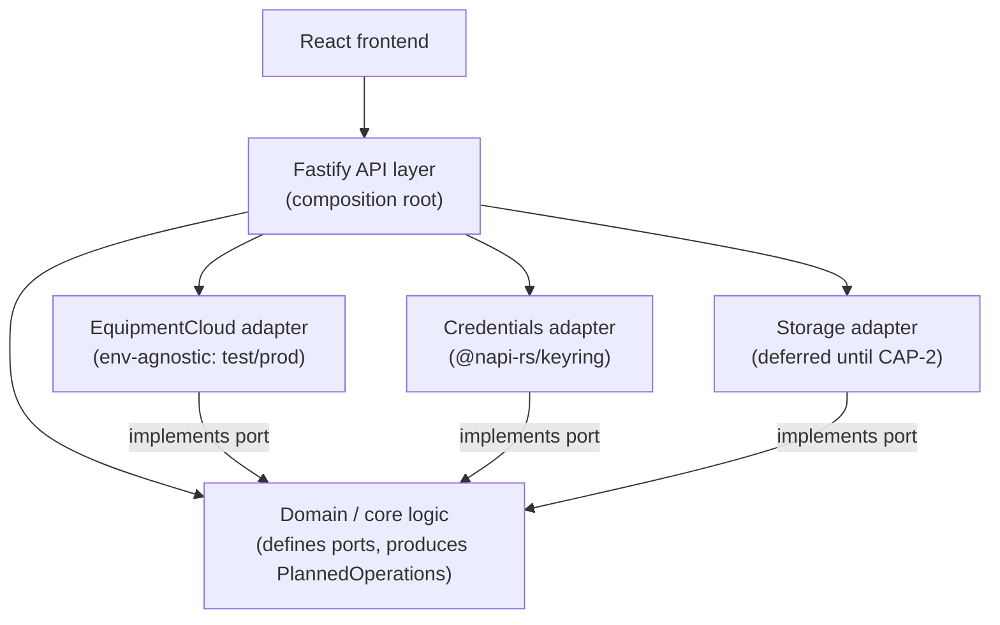
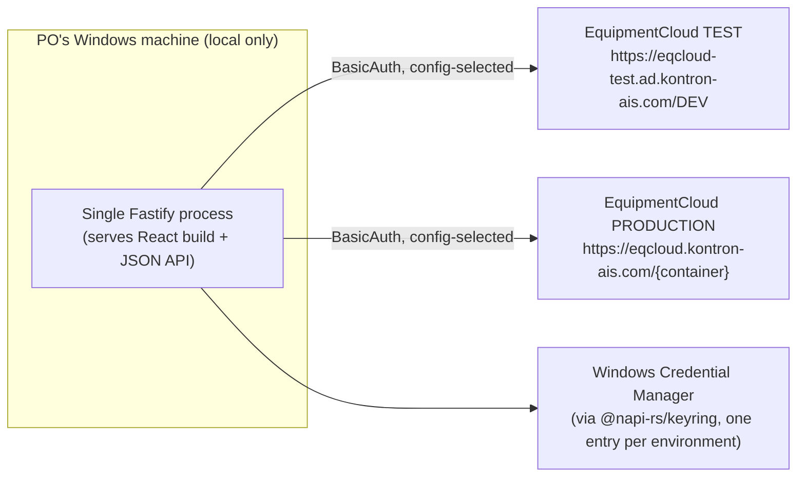
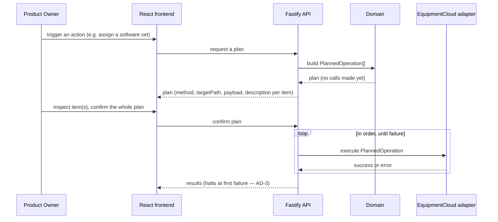

# Architecture Spine — customerportal-product-owner

## Design Paradigm

Ports & Adapters (Hexagonal). Domain/core logic (`src/domain/`) owns business rules and defines the ports it needs; it never imports HTTP, Fastify, a DB driver, or a credential library directly. Driven adapters (`src/adapters/*`) implement those ports. The domain's only way to cause an EquipmentCloud write is to produce data — a `PlannedOperation` — never to call out directly; a driving `api` layer stages those, a human confirms them, and only then does the EquipmentCloud adapter execute them (the Plan/Apply model, AD-2).

## Invariants & Rules



Read the arrows as "may depend on": adapters depend on (implement) the domain's port interfaces, never the reverse (AD-1); the API layer is the composition root — it is the only place allowed to import and wire concrete adapters together with the domain.

### AD-1 — Domain/adapter boundary

- **Binds:** all
- **Prevents:** business logic entangled with HTTP/DB/EquipmentCloud specifics, blocking independent testing and swapping adapters (environment switch, a future local-DB choice)
- **Rule:** code under `src/domain/` must not import an HTTP client, Fastify, a DB driver, or a credential library. It only depends on port interfaces; adapters under `src/adapters/*` implement them.

### AD-2 — Planned Operation contract (Plan/Apply write model) `[ADOPTED]`

- **Binds:** every write this tool makes to EquipmentCloud — product-facing (CAP-1 now; CAP-2 and any later capability) and operational (e.g. reseeding EquipmentCloud test data after a Test-environment reset — no separate write path is allowed for this)
- **Prevents:** each capability or script inventing its own write/confirmation flow, producing inconsistent review UX, duplicated confirmation logic, or a backdoor that skips confirmation entirely
- **Rule:** any EquipmentCloud write is expressed as a `PlannedOperation { method: POST|DELETE, targetPath, payload, description }` produced by domain code — nothing calls the EquipmentCloud write adapter directly, with no exception for tooling/scripts. The API layer stages a list of `PlannedOperation`s for the frontend; the user may inspect any single item's `targetPath`/`payload`; only after the user confirms the whole batch does Apply execute them.

### AD-3 — Apply halts at first failure `[ADOPTED]`

- **Binds:** the Apply execution path (all capabilities)
- **Prevents:** a batch left in an unclear, partially-applied state with no clear signal of what actually happened
- **Rule:** Apply executes a confirmed plan's `PlannedOperation`s strictly in order and stops immediately on the first failed call. Remaining operations in that plan are not attempted; the failure and the raw EquipmentCloud error are surfaced before anything else runs.

### AD-4 — Environment separation: EquipmentCloud adapter, credentials, and local storage `[ADOPTED]`

- **Binds:** EquipmentCloud adapter, credentials adapter, storage adapter
- **Prevents:** a hardcoded base URL/credential forcing a code change (and its regression risk) every time the tool switches between Test and Production; Test-derived local data silently mixing with Production-derived local data
- **Rule:** the EquipmentCloud adapter takes a base URL and a credential set as configuration. Two named environments are supported from day one — `test` (`https://eqcloud-test.ad.kontron-ais.com/DEV`) and `prod` (`https://eqcloud.kontron-ais.com/{container}`) — each with its own credential entry; the two are never shared or mixed. Whatever local storage exists (from CAP-2 onward — see AD-10, Deferred) is likewise partitioned per environment as a separate database/store, never a shared one with an environment column — a plan built from Test data must never be able to execute against, or be confused with, Production data, and vice versa.

### AD-5 — Only BasicAuth-secured endpoints are integrated `[ADOPTED]`

- **Binds:** EquipmentCloud adapter
- **Prevents:** accidentally wiring the adapter against the Bearer/OAuth2-secured `_oa` endpoint variants, which need a different auth flow this tool does not implement
- **Rule:** the adapter only calls EquipmentCloud paths whose OpenAPI `security:` block is `BasicAuth`. `_oa`-suffixed paths (e.g. `equipmenthub_oa`, `openissues_oa` — Bearer/OAuth2) are out of scope.

### AD-6 — Credentials never reach domain, API, or frontend code `[ADOPTED]`

- **Binds:** credentials adapter, EquipmentCloud adapter
- **Prevents:** credentials leaking into logs or source, or being handled ad hoc in more than one place
- **Rule:** credentials live in Windows Credential Manager via `@napi-rs/keyring`, one entry per environment. Only the EquipmentCloud adapter's construction step reads them; domain code, API routes, and the frontend never see a raw credential.

### AD-7 — Single-process deployment `[ADOPTED]`

- **Binds:** deployment
- **Prevents:** needing to coordinate or start more than one process for ordinary local use
- **Rule:** one Fastify process serves both the built React frontend (static) and the tool's own JSON API. Started with a single command; no server deployment — runs only on the Product Owner's own Windows machine.

### AD-8 — Plans are single-use, never replayed `[ADOPTED]`

- **Binds:** plan lifecycle, Apply execution
- **Prevents:** duplicate or non-idempotent writes from retrying a stale plan after a halt (AD-3), and executing against EquipmentCloud state that changed since the plan was built
- **Rule:** a plan is discarded the moment Apply finishes — whether it completed fully or halted on failure. There is no resume/retry of the same plan object. Operations already executed before a halt are done: EquipmentCloud is the source of truth for CAP-1 (AD-10), so nothing needs to be persisted locally to track "what succeeded." If the user wants to continue after a halt, the API builds a brand-new plan by re-reading current EquipmentCloud state — it never re-submits the old plan's remaining or failed items verbatim.

### AD-9 — A plan lives server-side, keyed by id `[ADOPTED]`

- **Binds:** plan lifecycle, API layer
- **Prevents:** two designs answering "does a browser refresh lose my plan?" differently (in-memory-in-the-browser vs. persisted) — a real, user-visible UX divergence hiding in the earlier "ephemeral" wording
- **Rule:** a built plan lives in the Fastify process's memory, keyed by a plan id the frontend holds; a browser refresh does not lose it (the frontend re-fetches by id), but restarting the Fastify process does. This is still "ephemeral" in the sense that matters (AD-8: never persisted to disk, never resumed across app restarts) — it is not stored in the deferred local DB.

### AD-10 — EquipmentCloud is authoritative for CAP-1 `[ADOPTED]`

- **Binds:** CAP-1 data, storage adapter
- **Prevents:** a local cache silently becoming a shadow source of truth that drifts from EquipmentCloud
- **Rule:** for CAP-1, EquipmentCloud is the sole source of truth; any local storage is a rebuildable cache only — never authoritative, safe to delete and re-fetch at any time. From CAP-2 onward, genuinely local-only data (no EquipmentCloud counterpart, e.g. issue-clustering groupings) is owned locally and is never synced back to EquipmentCloud.

## Consistency Conventions

| Concern | Convention |
| --- | --- |
| Naming (entities, files, interfaces, events) | A staged write is always a `PlannedOperation { method, targetPath, payload, description }` (AD-2) — no capability defines its own variant. |
| Data & formats (ids, dates, error shapes, envelopes) | CAP-1 passes EquipmentCloud ids/payload shapes through unchanged (no local remapping). CAP-2's local-only data gets its own id space and must never collide with or be mistaken for an EquipmentCloud id. |
| State & cross-cutting (mutation, errors, logging, config, auth) | All EquipmentCloud writes flow through Plan → confirm → Apply (AD-2), halting on first failure (AD-3). Environment (`test`/`prod`) is selected via config, never hardcoded (AD-4). Credentials are resolved only inside the credentials/EquipmentCloud adapters (AD-6). |

## Stack

| Name | Version |
| --- | --- |
| Node.js | 24 (Active LTS, supported to Apr 2028) |
| Fastify | 5.12.1 |
| Vite | 8.3.0 |
| React | 19.3.0 |
| TypeScript | current, per Vite `react-ts` template |
| @napi-rs/keyring | current (Windows Credential Manager access) |
| Local DB | deferred — see Deferred |

## Structural Seed





```text
{root}/
  src/
    domain/            # pure business logic (CAP-1 now, CAP-2 later) — no HTTP/DB/EquipmentCloud imports (AD-1)
    adapters/
      equipmentcloud/  # REST client; read ports + the Apply write port; environment-agnostic (AD-4)
      credentials/     # wraps @napi-rs/keyring, one entry per environment (AD-6)
      storage/         # local persistence adapter — no-op/cache for CAP-1, real store from CAP-2 (deferred)
    api/               # Fastify routes: build/inspect a plan, confirm + apply; serves the built frontend
  frontend/            # React (Vite) UI: plan review/inspection, CAP-1 software/set screens
  docs/
    specs/spec-eqcloud-portal/         # SPEC.md — product contract (companion to this spine)
    architecture/architecture-.../     # this spine
```

## Capability → Architecture Map

| Capability / Area | Lives in | Governed by |
| --- | --- | --- |
| CAP-1 — SoftwareCenter management | `src/domain/softwarecenter/`, `src/adapters/equipmentcloud/softwarecenter` | AD-1 – AD-10 |
| CAP-2 — OpenIssues clustering | `src/domain/openissues/` (future), `src/adapters/storage/` (future real store) | AD-1 – AD-10; local storage engine deferred |

## Deferred

- **Local DB engine** (incl. the graph/relationship-search need for CAP-2): not needed for CAP-1 (EquipmentCloud is sole source of truth there). Revisit when CAP-2 starts. Must support a user-configurable file location — the user intends to point it at a personal mapped network drive (`Z:`); check the chosen engine's reliability over a Windows network share first (embedded engines like SQLite are known to have file-locking issues there) before committing. Whatever engine is chosen must also support two fully separate stores, one per environment (AD-4) — e.g. two separate database files/directories, never one shared store with an environment column.
- **CAP-2 clustering mechanics** — what counts as a "bundled theme" and how issues/discussions are compared for commonality. Deferred until CAP-2 work starts (open question already in SPEC.md).
- **UI styling/component kit** (e.g. Tailwind + shadcn/ui) — cosmetic, low fork-risk, decide when the frontend is actually built.
- **SBOM generation wiring** (`npm sbom`, CycloneDX format) — mechanical, wire in once `package.json` exists (already a SPEC.md constraint).
- **Logging/observability conventions** — not yet needed for a single-user local tool; add if a real need appears.
- **Read/query pagination approach** — how a read port pages through large EquipmentCloud collections is not yet fixed; low fork-risk today (one reader: the domain), revisit if it causes real inconsistency.
- **Live staleness check before executing an operation** — whether Apply re-validates each operation against current EquipmentCloud state immediately before executing it, or trusts the plan as built, is not decided. Accepted as low-risk for now since the Product Owner is the tool's only writer; revisit if that assumption stops holding (e.g. a second person or automation starts writing to the same equipment/software data).
